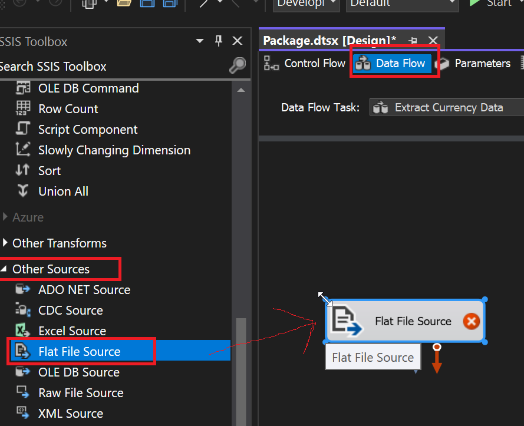

# Laborator 1: Cubul OLAP

## Sarcini

1. Să se creeze cubul OLAP;
2. Să se creeze o mapare tabel sursa -> tabel destinație;
3. Să se documenteze toți pașii.

Aceste pași trebuie să fie realizate pentru cele două baze de date: AdventureWorks și una personală.


## Instalarea componentelor

1. Să se instaleze Visual Studio;
2. Să se instaleze SQL Server Enterprise, cu componentele Reporting Services și Analysis Services (se alege la instalarea componentelor).
3. Să se urmeze pașii [aceștia](https://learn.microsoft.com/en-us/sql/ssdt/download-sql-server-data-tools-ssdt?view=sql-server-ver16) pentru a instala componentele necesare pentru a crea proiectul necesar în VS.


## Setarea bazei de date

1. Să se instaleze baza de date AdventureWorks conform instrucțiunilor de pe [această pagină](https://learn.microsoft.com/en-us/sql/samples/adventureworks-install-configure?view=sql-server-ver16&tabs=ssms);
2. Să se seteze proprietatea *Sql Server and Windows Authentication mode* (logarea sql este necesara pentru configurarea proiectului mai departe);
   
   

3. Să se creeze un login cu baza de date implicită AdventureWorks, și un user în baza de date;
   
4. Dați loginului posibilitatea de a accesa serverul SQL principal;
   
   

   

5. Dați userului posibilitatea de a accesa baza de date AdventureWorks și bifați permisiunile Connect și Select;

    

6. Pentru a privi diagramele din baza de date, trebuie să executați `use AdventureWorksDW2019 exec sp_changedbowner 'sa'` pe utilizatorul de pe care vreți să le vizualizați.


## Setarea proiectului în Visual Studio

1. Să se creeze proiectul de tip Analysis Services Multidimensional

    

2. Să se urmeze pașii de pe [această pagină](https://shristi08.medium.com/creating-cube-in-ssas-3c7e0fa5dd9f).

    

    

    

    

## Lansarea cubului în baza de date

<!-- Dacă ne uităm la meniul de lansare (deployment) în proiectul în Visual Studio, vedem următoarea eroare:

```
Either the user, 'DESKTOP-SSIOI5J\Anton', does not have access to the 'AdventureWorks1' database, or the database does not exist.
```

Acum dacă ne uităm la setările bazei de date, vedem că numele bazei de date este AdventureWorks1, însă așa baza de date nu există. 

 -->


Primesc o eroare:

```
You cannot deploy the model because the localhost deployment server is not running in multidimensional mode.
```

### Rezolvarea erorii

Soluția la această problemă am găsit-o [aici](https://www.sanssql.com/2013/11/change-ssas-deployment-mode-from.html). 
[Aici](https://learn.microsoft.com/en-us/analysis-services/multidimensional-models/attach-and-detach-analysis-services-databases?view=asallproducts-allversions) se descrie ce înseamnă detașarea lor `multidimensional Analysis services databases` (pasul 2 din instrucțiuni).


După o apasare pe Script, arată Success.


Deoarece fișierul cu configurația `msmdsrv.ini` care trebuie modificat poate fi citit sau modificat doar de administratori, trebuie să modific permisiunile:


Modific valoarea lui DeploymentMode de la 2 (Tabular) la 0 (Multidimensional).


Acum trebuie să restartez Analyses Services.


Acum lansarea lucrează în Visual Studio.


### Lucrul cu cubul

Lansez procesarea cubului:


Acum lucrează și browser-ul.
Eu nu știu ce să aștept din asta, de aceea pur și simplu arăt tabelul. Nu știu cum să analizez aceasta.


## Crearea cubului pe tema proprie

Varianta: *3.*

Tema: *Depozit de date în sistemul de vînzare a biletelor la autobus.*

Fapte: `vinzare_volum`, `vinzare_cantitati_bilete`, Dimensiuni: `timp`, `locatie`, `zona`, `tara`.


### Interpretarea sarcinii

Faptul `vinzare_volum` cred că presupune suma de bani la care s-au vândut biletele într-o zi.
Faptul `vinzare_cantitati_bilete` arată numărul de bilete.
Nu văd sensule să pun aceste date în tabele diferite, deoarece sunt proporționale și se referă la același fapt conceptual.
Din aceasta cauza, le voi face câmpurile în tabelul `Fact_Bilet`.

Dimensiunile indică fiecare zi, fiecare loc de vânzare.
Voi crea căte un tabel pentru timp (`Dim_Timp`) și pentru localicate (`Dim_Location`).

Tabelul faptului va avea o referință la dimensiuni.

### Crearea bazei de date și a tabelelor


[priviti codul folosit pentru crearea tabelelor](./sql/CreateTables.sql).


### Adaugarea datelor în baza de date

Am scris un program în D care l-am folosit pentru a genera datele în mod aleator.

Pornesc programul, redirectând output-ul spre `output.sql`. Execut fișierul pentru a adăuga datele.

Acum verific dacă au fost adăugate datele, folosind [interogarea](./sql/ShowData.sql).

id    | vinzare_volum | vinzare_cantitati_bilete | locatie_id | timp_id | id  | locatie  | zona  | tara        | id | zi | luna | saptamana | an   | data_concreta
------|---------------|--------------------------|------------|---------|-----|----------|-------|-------------|----|----|------|-----------|------|--------------
2340  | 1703808.00    | 17748                    | 365        | 7       | 365 | Bruges   | Zone1 | Belgium     | 7  | 14 | 10   | 2         | 2022 | 2022-10-14
2935  | 1624896.00    | 17856                    | 354        | 9       | 354 | Antwerp  | Zone7 | Belgium     | 9  | 23 | 10   | 2         | 2022 | 2022-10-23
2326  | 1590498.00    | 17478                    | 348        | 7       | 348 | Antwerp  | Zone1 | Belgium     | 7  | 14 | 10   | 2         | 2022 | 2022-10-14
13174 | 1505088.00    | 15678                    | 357        | 44      | 357 | Ghent    | Zone1 | Belgium     | 44 | 3  | 9    | 1         | 2023 | 2023-09-03
11134 | 1477476.00    | 16236                    | 365        | 37      | 365 | Bruges   | Zone1 | Belgium     | 37 | 19 | 5    | 2         | 2023 | 2023-05-19
2927  | 1418976.00    | 18192                    | 344        | 9       | 344 | Nijmegen | Zone1 | Netherlands | 9  | 23 | 10   | 2         | 2022 | 2022-10-23
2932  | 1407624.00    | 15816                    | 350        | 9       | 350 | Antwerp  | Zone3 | Belgium     | 9  | 23 | 10   | 2         | 2022 | 2022-10-23
2328  | 1396872.00    | 16056                    | 352        | 7       | 352 | Antwerp  | Zone5 | Belgium     | 7  | 14 | 10   | 2         | 2022 | 2022-10-14
2323  | 1384416.00    | 15048                    | 344        | 7       | 344 | Nijmegen | Zone1 | Netherlands | 7  | 14 | 10   | 2         | 2022 | 2022-10-14
13188 | 1369350.00    | 16110                    | 375        | 44      | 375 | Leuven   | Zone3 | Belgium     | 44 | 3  | 9    | 1         | 2023 | 2023-09-03
2344  | 1361160.00    | 14328                    | 369        | 7       | 369 | Bruges   | Zone5 | Belgium     | 7  | 14 | 10   | 2         | 2022 | 2022-10-14


# Laboratorul 2: Pachetul ETL

## Introducere

ETL semnifică procesul Extract - Transform - Load care integrează datele din mai multe surse 
într-un singur data warehouse, într-un format integru comun.
Acesta este necesar în continuare pentru a rula algoritmele de analiză a datelor.

În continuare, vom încărca fișierele plate de date mostră într-un proiect nou ETL,
și le vom transforma în formatul acestora din baza de date AdventureWorks. 

## Instalarea componentelor

În plus, doar trebuie să mai instalăm pachetul [SQL Server Integration Services (SSIS) Tutorial Files](https://www.microsoft.com/en-us/download/details.aspx?id=56827).
Acesta conține datele mostră valutare. 
<!-- Acestea trebuie fi plasate în folderul `C:\Program Files\Microsoft SQL Server\100\Samples\Integration Services\Tutorial\Creating a Simple ETL Package`
(este posibil să se plaseze și în alt loc, dar astfel va trebui să configurați drumurile la mai multe locuri). -->
Extragem aceasă arhivă undeva.

Exemplu unui din fișiere: include datele de valoare medie a valutei și rata la sfârșitul zilei, denumirea valutei, și data cu ora. 

```
0.516022499	BRL	7/1/2005 0:00	0.514959576
0.517089819	BRL	7/2/2005 0:00	0.517330574
0.516555607	BRL	7/3/2005 0:00	0.514403292
0.518268982	BRL	7/4/2005 0:00	0.519480519
0.517625136	BRL	7/5/2005 0:00	0.516262261
0.517330574	BRL	7/6/2005 0:00	0.519480519
0.517330574	BRL	7/7/2005 0:00	0.516022499
0.517330574	BRL	7/8/2005 0:00	0.520060801
0.517330574	BRL	7/9/2005 0:00	0.517089819
0.518403318	BRL	7/10/2005 0:00	0.520860461
0.518161563	BRL	7/11/2005 0:00	0.51786639
0.519076045	BRL	7/12/2005 0:00	0.520318435
```

## Crearea proiectului ETL

Ca să creăm un proiect destinat dezvoltării unui pachet ETL, trebuie să 
deschidem Visual Studio și să selectăm șablonul "Integration Services Project".


## Încărcarea datelor plate în proiect

În primul rând, trebuie să se creeze un "Flat File connection manager".
Acesta permite specificarea locației fișierului, delimitorilor coloanelor,
tipul de date pentru fiecare coloană.
Acesta include și opțiunea Suggest Column Types pentru a ghici tipul datelor din propriu zise datele.

Pentru fiecare tip de fișier de date, trebuie fi creată câte un astfel de manager.
Deoarece toate datele din exemplu sunt în același format, ajunge să creăm unul singur 
și să-l folosim pentru mai multe înregistrări.


Apăsăm "Add". Apare o fereastră, unde indicăm numele, descriere.
Selectăm fișierul `SampleCurrencyData.txt`, apasând butonul "Browse".


Acum dacă trecem în meniul "Columns", vedem meniul de configurarea a tipurilor de coloane.


Trebuie să dăm câte un nume descriptiv la fiecare coloană și să le atribuim tipurile corecte de date.
Pentru aceasta, trecem în meniul "Advanced", și schimbăm denumirea la fiecare coloană, folosind
grid-ul de proprietăți în partea dreaptă.


Apăsăm Suggest Types și facem click pe OK, lăsând toate opțiunile la valorile lor implicite.


Sistemul a putut ghici tipul de date la numere corect, dar a evaluat șirurile
care reprezintă data și timpul ca simplu șiruri, dar nu ca `date`.
Din această cauză trebuie s-o schimbăm la `date` manual.


## Configurarea managerului OLE

Managerul OLE permite a se conecta la baza de date.


Acesta lucrează în același mod ca și din etapa setării cubului, de aceea nu arăt procedura de crearea.


## Conectarea fluxului de date dintre intrare și destinație

Ca să conectăm manager-urile acestea unul la altul, trebuie să creăm așa numitul Data Flow.
Acesta include și mecanismele de transformare și curățare a datelor.

### Crearea Data Flow


Îi putem schimba denumirea, apăsând `F2` și scriind denumirea nouă.


Acum trebuie să adaugăm un "Flat File source", care va încărca un fișier cu date, folosind schema definită
în "Flat File connection manager" creat anterior.



Apăsăm de doi ori pentru a deschide meniul de configurare a sursei și apăsăm Ok.


### Configurarea transformărilor

Acum trebuie să configurăm în ce mod să se realizeze transformarea, folosind Lookup transformation:

- Prima transformare va face un lookup de `CurrencyKey` din tabelul `DimCurrecy` pe baza la coloana `CurrencyID`.

- A doua transformare va face un lookup de `DateKey` din tabelul `DimDate` pe baza la coloana `CurrencyDate`.


Facem dublu click și trecem la meniul "Connection".
Aici, scriem următoarea interogarea SQL ca sursă de date.
Această interogarea include toate datele din tabelul DimCurrency unde tipul valutei este unul din formate
de intrare suportate.
Acestea ca atare trebuie fi extrase din fișierele de intrare, dar drept test vom face doar așa.


Acum conectăm proprietățile `CurrencyID` cu `CurrencyAlternateKey` din baza de date pentru a realiza lookup-ul,
și punem bifa pe lângă `CurrencyKey` ca s-o facem output-ul lookup-ului.


Plasăm o componentă pentru al doilea lookup.
Conectăm primul lookup (săgeata albastră) la componenta nouă.
În fereastra care a apărul selectăm "Lookup Matched Output".


În meniul "General" alegem partial cache (tutorialul zice să facem așa, nu știu pentru ce este necesar).
În meniul "Connection" alegem tabelul `DimDate`.


Configurăm lookup-ul să mapeze `CurrencyDate` la `DateKey`, cheia principală din baza de date.


### Conectarea destinației

Rămâne să conectăm un OLE DB Destination pentru a realiza scrierea finală în baza de date.
Conectăm ultimul Lookup la nodul de destinație (săgeata albastră).


În meniul de configurare a noului nod, selectăm tabelul `FactCurrencyRate`:


Apăsăm "New" pentru a crea un tabel destinație nou cu aceleași coloane ca și tabelul de referință.


Configurăm mapările pentru toate coloanele:


Am terminat configurarea.

## Rularea pachetului

Pentru a rula pachetul, apăsăm "Start".
În cazul meu, am primit mesajul că execuția s-a terminat cu succes.

Pentru a confirma că datele au fost adăugate, rulăm o interogare:


## Concluzii

Personal, nu aș folosi sistemul acesta în sisteme reale.
Îmi plac mai mult sisteme realizate în limbaje de programare, 
deoarece atunci aveți mai multă flexibilitate, și mai puțin duplicare de logică.
Puteți utiliza și orice modalități de programare pentru a simplifica configurarea sistemului.


# Laborator 3: Crearea unui Raport în SSRS

## Introducere

SSRS (SQL Server Reporting Services) este un instrument care permite ...

## Crearea proiectului

Deschidem Visual Studio și instanțiem șablonul "Report Server Project".


## Configurarea unui Data Source

Procesul aici este asemănător cu cela descris anterior, de aceea nu explic detaliat.


## Crearea reportului

Apăsăm right click pe "Reports", "Add".
Clar că selectăm conexiunea existentă, numai ce creată.

### Configurarea interogării

Raportul permite crearea interogării folosind builder-ul, sau a unei interogări SQL.
Pentru simplitate, vom scrie textul interogării direct în wizard-ul de creare a raportului.

Am elaborat astfel de interogare:


Și am pus-o ca "Query string".

Acum selectăm tipul. Vom lăsa varianta implicită.


Am configurat output-ul în așa mod:


Apăsăm "Finish".

## Vizualizarea rezultatelor

Putem privi reportul, apăsând "Preview".


Putem sălva reportul în formatul, de exemplu, PDF, apăsând iconița respectivă:


## Concluzii

Funcția este utilă deoarece produce reporturi într-un format consistent.
Are foarte multe opțini pe care nu le-am descris aici, ca, de exemplu, 
modalitățile de vizualizare și de formatare a tabelelor, gruparea, totalizarea,
adăugarea stilurilor, ș.a.
