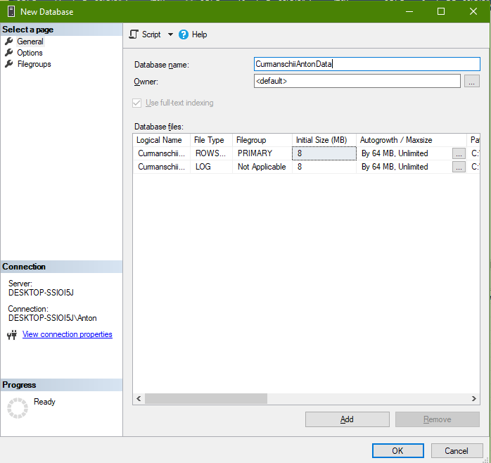

## Sarcini

1. Să se creeze cubul OLAP;
2. Să se creeze o mapare tabel sursa -> tabel destinație;
3. Să se documenteze toți pașii.

Aceste pași trebuie să fie realizate pentru cele două baze de date: AdventureWorks și una personală.


## Instalarea componentelor

1. Să se instaleze Visual Studio;
2. Să se instaleze SQL Server Enterprise, cu componentele Reporting Services și Analysis Services (se alege la instalarea componentelor).
3. Să se urmeze pașii [aceștia](https://learn.microsoft.com/en-us/sql/ssdt/download-sql-server-data-tools-ssdt?view=sql-server-ver16) pentru a instala componentele necesare pentru a crea proiectul necesar în VS.


## Setarea bazei de date

1. Să se instaleze baza de date AdventureWorks conform instrucțiunilor de pe [această pagină](https://learn.microsoft.com/en-us/sql/samples/adventureworks-install-configure?view=sql-server-ver16&tabs=ssms);
2. Să se seteze proprietatea *Sql Server and Windows Authentication mode* (logarea sql este necesara pentru configurarea proiectului mai departe);
   
   

3. Să se creeze un login cu baza de date implicită AdventureWorks, și un user în baza de date;
   
4. Dați loginului posibilitatea de a accesa serverul SQL principal;
   
   

   

5. Dați userului posibilitatea de a accesa baza de date AdventureWorks și bifați permisiunile Connect și Select;

    

6. Pentru a privi diagramele din baza de date, trebuie să executați `use AdventureWorksDW2019 exec sp_changedbowner 'sa'` pe utilizatorul de pe care vreți să le vizualizați.


## Setarea proiectului în Visual Studio

1. Să se creeze proiectul de tip Analysis Services Multidimensional

    

2. Să se urmeze pașii de pe [această pagină](https://shristi08.medium.com/creating-cube-in-ssas-3c7e0fa5dd9f).

    

    

    

    

## Lansarea cubului în baza de date

<!-- Dacă ne uităm la meniul de lansare (deployment) în proiectul în Visual Studio, vedem următoarea eroare:

```
Either the user, 'DESKTOP-SSIOI5J\Anton', does not have access to the 'AdventureWorks1' database, or the database does not exist.
```

Acum dacă ne uităm la setările bazei de date, vedem că numele bazei de date este AdventureWorks1, însă așa baza de date nu există. 

 -->


Primesc o eroare:

```
You cannot deploy the model because the localhost deployment server is not running in multidimensional mode.
```

### Rezolvarea erorii

Soluția la această problemă am găsit-o [aici](https://www.sanssql.com/2013/11/change-ssas-deployment-mode-from.html). 
[Aici](https://learn.microsoft.com/en-us/analysis-services/multidimensional-models/attach-and-detach-analysis-services-databases?view=asallproducts-allversions) se descrie ce înseamnă detașarea lor `multidimensional Analysis services databases` (pasul 2 din instrucțiuni).


După o apasare pe Script, arată Success.


Deoarece fișierul cu configurația msmdsrv.ini care trebuie modificat poate fi citit sau modificat doar de administratori, trebuie să modific permisiunile:


Modific valoarea lui DeploymentMode de la 2 (Tabular) la 0 (Multidimensional).


Acum trebuie să restartez Analyses Services.


Acum lansarea lucrează în Visual Studio.


### Lucrul cu cubul

Lansez procesarea cubului:


Acum lucrează și browser-ul.
Eu nu știu ce să aștept din asta, de aceea pur și simplu arăt tabelul. Nu știu cum să analizez aceasta.


## Crearea cubului pe tema proprie

Varianta: *3.*

Tema: *Depozit de date în sistemul de vînzare a biletelor la autobus.*

Fapte: vinzare_volum, vinzare_cantitati_bilete, Dimensiuni: timp, locatie, zona, tara.


### Interpretarea sarcinii

Faptul `vinzare_volum` cred că presupune suma de bani la care s-au vândut biletele într-o zi.
Faptul `vinzare_cantitati_bilete` arată numărul de bilete.
Nu văd sensule să pun aceste date în tabele diferite, deoarece sunt proporționale și se referă la același fapt conceptual.
Din aceasta cauza, le voi face câmpurile în tabelul `Fact_Bilet`.

Dimensiunile indică fiecare zi, fiecare loc de vânzare.
Voi crea căte un tabel pentru timp (`Dim_Timp`) și pentru localicate (`Dim_Location`).

Tabelul faptului va avea o referință la dimensiuni.

### Crearea bazei de date și a tabelelor



[priviti codul folosit pentru crearea tabelelor](./sql/CreateTables.sql).


### Adaugarea datelor în baza de date

Am scris un program în D care l-am folosit pentru a genera datele în mod aleator.

Pornesc programul, redirectând output-ul spre `output.sql`. Execut fișierul pentru a adăuga datele.

Acum verific dacă au fost adăugate datele, folosind [interogarea](./sql/ShowData.sql).

id    | vinzare_volum | vinzare_cantitati_bilete | locatie_id | timp_id | id  | locatie  | zona  | tara        | id | zi | luna | saptamana | an   | data_concreta
------|---------------|--------------------------|------------|---------|-----|----------|-------|-------------|----|----|------|-----------|------|--------------
2340  | 1703808.00    | 17748                    | 365        | 7       | 365 | Bruges   | Zone1 | Belgium     | 7  | 14 | 10   | 2         | 2022 | 2022-10-14
2935  | 1624896.00    | 17856                    | 354        | 9       | 354 | Antwerp  | Zone7 | Belgium     | 9  | 23 | 10   | 2         | 2022 | 2022-10-23
2326  | 1590498.00    | 17478                    | 348        | 7       | 348 | Antwerp  | Zone1 | Belgium     | 7  | 14 | 10   | 2         | 2022 | 2022-10-14
13174 | 1505088.00    | 15678                    | 357        | 44      | 357 | Ghent    | Zone1 | Belgium     | 44 | 3  | 9    | 1         | 2023 | 2023-09-03
11134 | 1477476.00    | 16236                    | 365        | 37      | 365 | Bruges   | Zone1 | Belgium     | 37 | 19 | 5    | 2         | 2023 | 2023-05-19
2927  | 1418976.00    | 18192                    | 344        | 9       | 344 | Nijmegen | Zone1 | Netherlands | 9  | 23 | 10   | 2         | 2022 | 2022-10-23
2932  | 1407624.00    | 15816                    | 350        | 9       | 350 | Antwerp  | Zone3 | Belgium     | 9  | 23 | 10   | 2         | 2022 | 2022-10-23
2328  | 1396872.00    | 16056                    | 352        | 7       | 352 | Antwerp  | Zone5 | Belgium     | 7  | 14 | 10   | 2         | 2022 | 2022-10-14
2323  | 1384416.00    | 15048                    | 344        | 7       | 344 | Nijmegen | Zone1 | Netherlands | 7  | 14 | 10   | 2         | 2022 | 2022-10-14
13188 | 1369350.00    | 16110                    | 375        | 44      | 375 | Leuven   | Zone3 | Belgium     | 44 | 3  | 9    | 1         | 2023 | 2023-09-03
2344  | 1361160.00    | 14328                    | 369        | 7       | 369 | Bruges   | Zone5 | Belgium     | 7  | 14 | 10   | 2         | 2022 | 2022-10-14


## Crearea pachetului ETL în baza exemplului Adventure Works

ETL semnifică procesul Extract - Tranform - Load care integrează datele din mai multe surse 
într-un singur data warehouse, într-un format integru comun.
Acesta este necesar pentru a rula algoritmele de analiză a datelor în continuare.

### Instalarea componentelor

În plus, doar trebuie să mai instalăm pachetul [SQL Server Integration Services (SSIS) Tutorial Files](https://www.microsoft.com/en-us/download/details.aspx?id=56827).
Acesta conține datele mostră.
Acestea trebuie fi plasate în folderul `C:\Program Files\Microsoft SQL Server\100\Samples\Integration Services\Tutorial\Creating a Simple ETL Package`
(este posibil să se plaseze și în alt loc, dar) astfel 