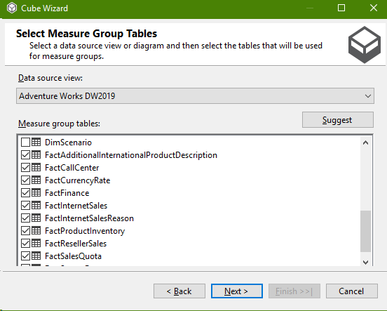

## Sarcini

1. Să se creeze cubul OLAP;
2. Să se creeze o mapare tabel sursa -> tabel destinație;
3. Să se documenteze toți pașii.

Aceste pași trebuie să fie realizate pentru cele două baze de date: AdventureWorks și una personală.

## Instalarea componentelor

1. Să se instaleze Visual Studio;
2. Să se instaleze SQL Server Enterprise, cu componentele Reporting Services și Analysis Services (se alege la instalarea componentelor).
3. Să se urmeze pașii [aceștia](https://learn.microsoft.com/en-us/sql/ssdt/download-sql-server-data-tools-ssdt?view=sql-server-ver16) pentru a instala componentele necesare pentru a crea proiectul necesar în VS.

## Setarea bazei de date

1. Să se instaleze baza de date AdventureWorks conform instrucțiunilor de pe [această pagină](https://learn.microsoft.com/en-us/sql/samples/adventureworks-install-configure?view=sql-server-ver16&tabs=ssms);
2. Să se seteze proprietatea *Sql Server and Windows Authentication mode* (logarea sql este necesara pentru configurarea proiectului mai departe);
   
   

3. Să se creeze un login cu baza de date implicită AdventureWorks, și un user în baza de date;
   
4. Dați loginului posibilitatea de a accesa serverul SQL principal;
   
   

   

5. Dați userului posibilitatea de a accesa baza de date AdventureWorks și bifați permisiunile Connect și Select;

    

6. Pentru a privi diagramele din baza de date, trebuie să executați `use AdventureWorksDW2019 exec sp_changedbowner 'sa'` pe utilizatorul de pe care vreți să le vizualizați.

## Setarea proiectului în Visual Studio

1. Să se creeze proiectul de tip Analysis Services Multidimensional

    

2. Să se urmeze pașii de pe [această pagină](https://shristi08.medium.com/creating-cube-in-ssas-3c7e0fa5dd9f).

    

    

    

    

