## Sarcini

Să se realizeze un setup data mining de bază pe baza bazei de date Adventure Works.

Problema este că [nu mai putem folosi Data Mining în versiunile noi SSDT](https://learn.microsoft.com/en-us/analysis-services/data-mining/create-a-new-olap-mining-structure?view=asallproducts-allversions).
Încă, folosirea acestei capacități în SSAS nu este recomandată deloc. Se recomandă a fie folosite instrumentele serioase, ca [RevoScaleR](https://tecflix.com/news/microsoft-open-sources-sql-server-machine-learning-and-discontinues-ml-server) sau [Power BI](https://blog.crossjoin.co.uk/2022/12/).

În această lucrare, eu voi ilustra conceptele lui DataMining folosind aplicația Weka.


## Algoritmii folosiți pentru Data Mining

Sunt patru categorii de aplicare a algoritmilor de Data Mining:

1. Clasificarea:
    - Atribuirea unor da / nu flaguri;
    - Categorizarea la mai multe clase;
    - Algoritmii sunt următoarele: Naive Bayes, Decision Trees, Clustering, Neural Networks, ș.a.

2. Regresia:
    - Generarea unor valori numerice de predicție;
    - Algoritmii sunt următoarele: Decision Trees, Linear Regression, ș.a.

3. Clustering:
    - Găsirea unor grupuri de date similare;
    - Algoritmii sunt următoarele: K-Means, Expectation Maximization, ș.a.

4. Asocierea:
    - Găsirea unor reguli de asociere între date;
    - Algoritmii sunt următoarele: Apriori, FP-Growth, ș.a.
 

În continuare, voi prezenta câteva exemple de algoritmi de Data Mining, ilustrate folosind aplicația Weka
și seturi de date incluse în acesta.

## Weka

Workbench-ul Weka este o colecție de algoritmi de învățare automată
de ultimă generație și instrumente de preprocesare a datelor.
Este conceput astfel încât să puteți încerca rapid metodele existente pe noi seturi de date în moduri flexibile.
Oferă un sprijin extins pentru întregul proces de extragere experimentală a datelor,
inclusiv pregătirea datelor de intrare, evaluarea învățării schemele de învățare în mod statistic
și vizualizarea datelor de intrare și a rezultatului învățării.
Pe lângă varietății mari de algoritmi de învățare, include o gamă largă instrumente de preprocesare.
Acest set de instrumente diverse și cuprinzătoare este accesat prin intermediul unei interfețe comune,
astfel încât utilizatorii săi să poată compara diferite metode și să le identifice pe cele care sunt cele mai
adecvate pentru problema în cauză.

Weka a fost dezvoltat la Universitatea Waikato din Noua Zeelandă;
numele înseamnă Waikato Environment for Knowledge Analysis (Mediul Waikato pentru analiza cunoștințelor).

> În afara universității, weka, pronunțată pentru a rima cu Mecca, este o pasăre fără zbor
> de natură curioasă, care se găsește doar pe insulele din Noua Zeelandă.

Sistemul este scris în Java și distribuit în conformitate cu termenii Licenței publice generale GNU.
Acesta rulează pe aproape orice platformă și a fost testat pe sistemele de operare Linux, Windows și Macintosh.

## Interfața Weka

Când pornim aplicația de prima dată, vedem o astfel de fereastră:

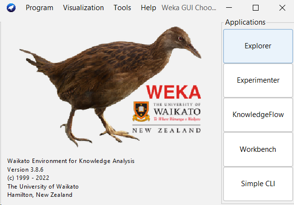

În partea dreaptă, avem o listă de aplicații din Weka. Cele mai importante sunt:

- Explorer: interfața principală care permite accesarea tuturor facilităților Weka.
   printr-un sistem de forme și meniuri.
   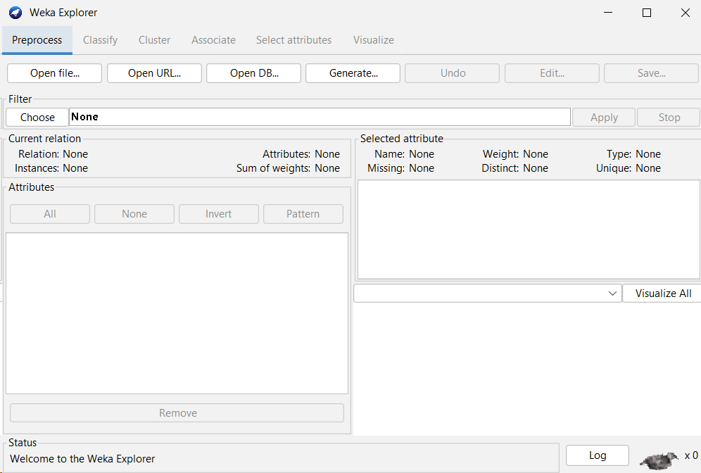 
 
- Experimenter: interfață pentru efectuarea de experimente de învățare automată.
   pe seturi de date.
   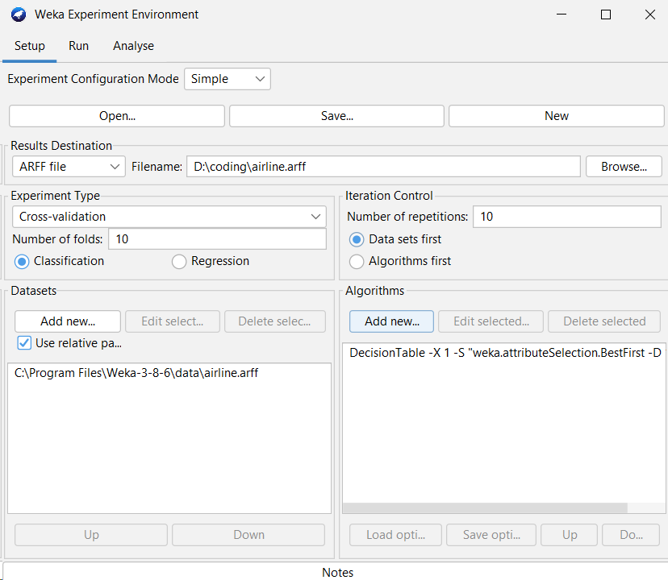

- Knowledge Flow: interfață pentru construirea de fluxuri de lucru de analiză a datelor.
   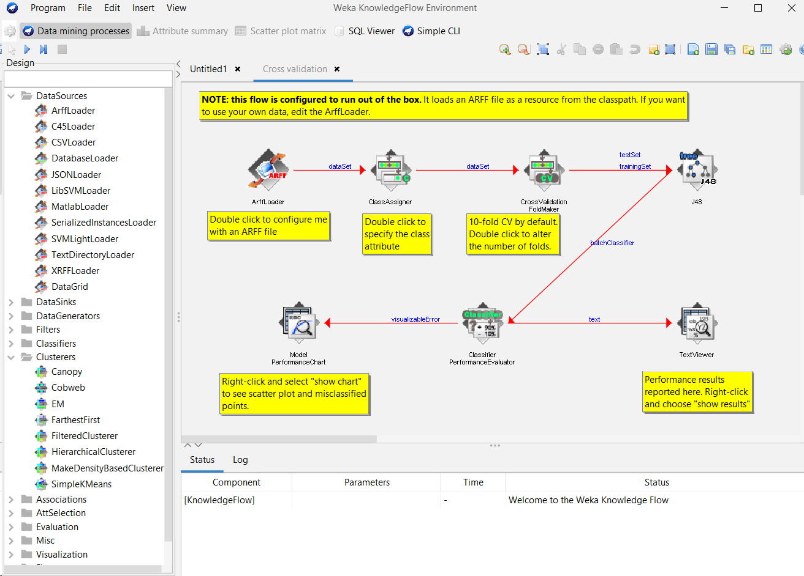

- Simple CLI: interfață de linie de comandă simplă pentru Weka.


În această lucrare folosesc explorer-ul.


### Formatul datelor

Primul pas la folosirea oricărui alogirtm de Data Mining este pregătirea datelor.
Formatul care este cel mai des utilizat este ARFF (Attribute-Relation File Format).
Acesta poate fi ușor generat, pornind de la un fișier CSV.

Un fișier ARFF este un fișier text care descrie un set de exemple împreună cu
atributele lor. Acesta este folosit de Weka pentru a înțelege structura datele.

Urmează un exemplu de fișier CSV, urmat cu varianta acelorași date în ARFF.

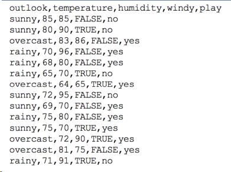

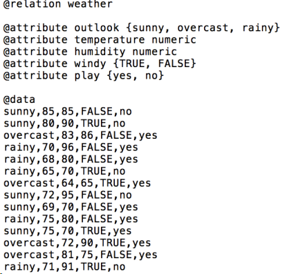

Tab-urile din bara de sus arată operațiunile care noi putem efectua asupra datelor.
La moment, suntem la tab-ul de preprocesare a datelor.

Haideți să încărcăm un fișier cu setul de date pentru florile Iris, inclus în distribuția Weka. 

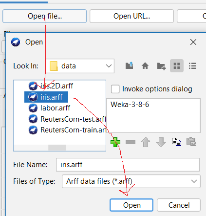

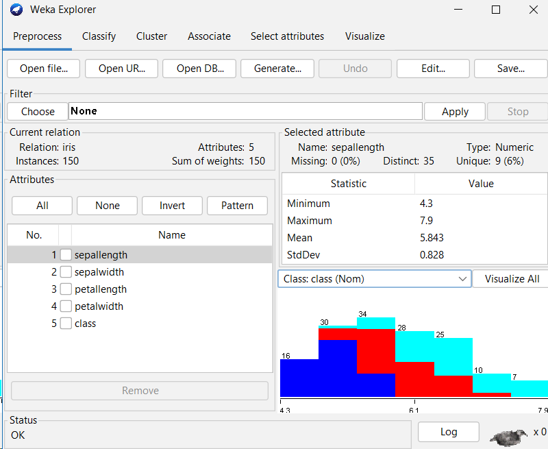

Interfața în răspuns arată proprietățile, niște statistici asociate cu datele
și o vizualizare care arată cât de des apare fiecare din valori ale proprietății implicite (cred că) `sepallength`.
dar putem selecta orice alt atribut, atunci ne-ar arăta distribuția valorilor
pentru acel atribut.
De exemplu, arătăm distribuția valorilor pentru `class`.

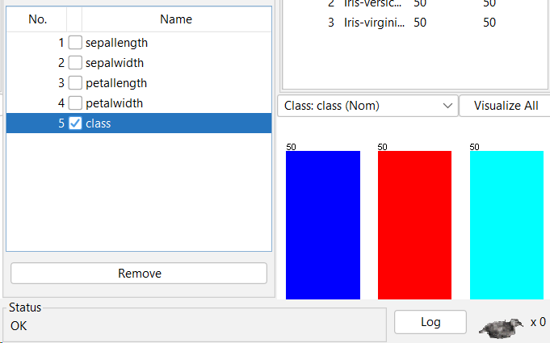

Sau pentru toate proprietățile în același timp:

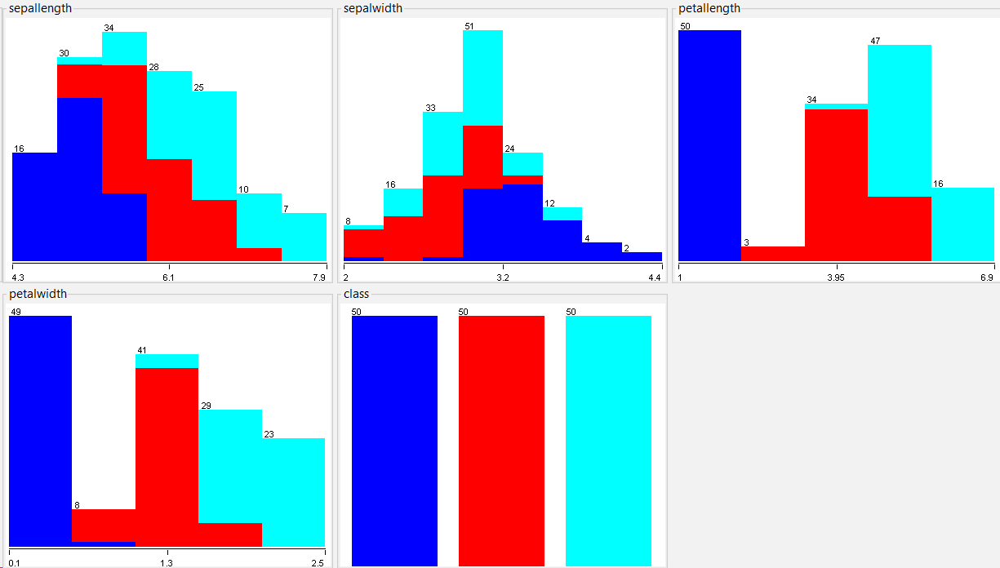

Culorile diferite indică clasificările după atributul `class`.


### Construirea unui arbore de decizie

Accesăm tab-ul "Classify", apăsăm "Choose" și selectăm în lista care apare
algoritmul "J4.8" (un algoritm de învățare automată bazat pe arbori de decizie).

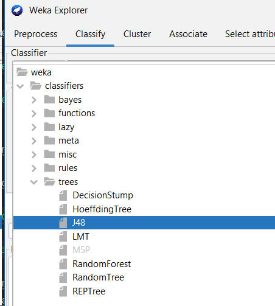

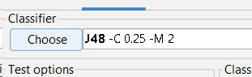

Algoritmul a fost instalat cu parametrii implicite care le putem schimba, accesând meniul
respectiv prin apăsarea șirului cu text.

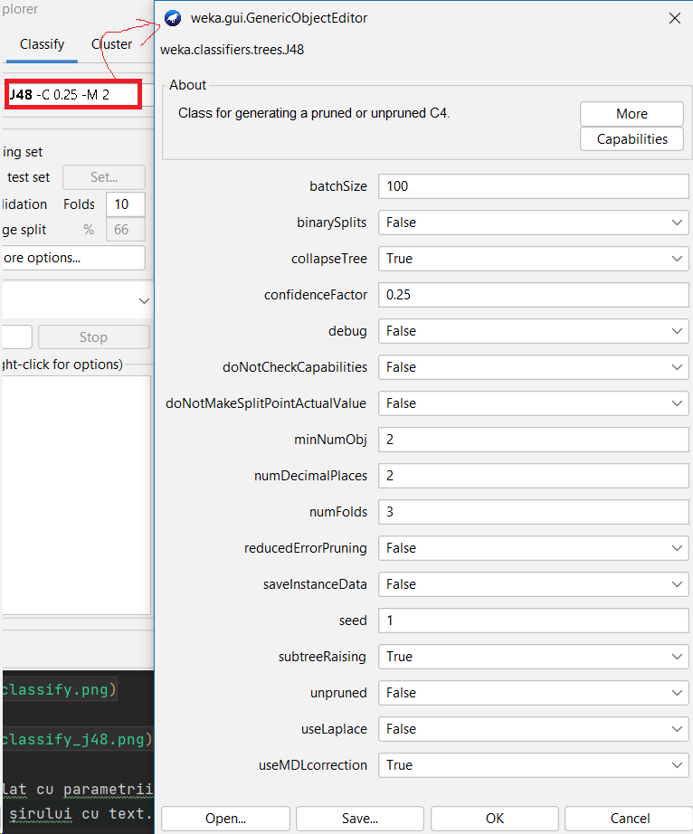

Apăsăm butonul start, și imediat vedem reportul cu rezultatele în partea dreapra:

Informațiile despre algoritmul rulat și setul de date:

```
=== Run information ===

Scheme:       weka.classifiers.trees.J48 -C 0.25 -M 2
Relation:     iris
Instances:    150
Attributes:   5
              sepallength
              sepalwidth
              petallength
              petalwidth
              class
Test mode:    10-fold cross-validation
```

Arborele de decizie.
Arborele arată în forma plată, dar nu în forma unui graf vizual.

```
=== Classifier model (full training set) ===

J48 pruned tree
------------------

petalwidth <= 0.6: Iris-setosa (50.0)
petalwidth > 0.6
|   petalwidth <= 1.7
|   |   petallength <= 4.9: Iris-versicolor (48.0/1.0)
|   |   petallength > 4.9
|   |   |   petalwidth <= 1.5: Iris-virginica (3.0)
|   |   |   petalwidth > 1.5: Iris-versicolor (3.0/1.0)
|   petalwidth > 1.7: Iris-virginica (46.0/1.0)

Number of Leaves  : 	5

Size of the tree : 	9
```

Datele despre rezultate, ca numărul de instanțe clasificate corect de arborele de decizie dat,
respectiv și greșit, precum și alte statistici.

```
=== Stratified cross-validation ===
=== Summary ===

Correctly Classified Instances         144               96      %
Incorrectly Classified Instances         6                4      %
Kappa statistic                          0.94  
Mean absolute error                      0.035 
Root mean squared error                  0.1586
Relative absolute error                  7.8705 %
Root relative squared error             33.6353 %
Total Number of Instances              150     

=== Detailed Accuracy By Class ===

                 TP Rate  FP Rate  Precision  Recall   F-Measure  MCC      ROC Area  PRC Area  Class
                 0.980    0.000    1.000      0.980    0.990      0.985    0.990     0.987     Iris-setosa
                 0.940    0.030    0.940      0.940    0.940      0.910    0.952     0.880     Iris-versicolor
                 0.960    0.030    0.941      0.960    0.950      0.925    0.961     0.905     Iris-virginica
Weighted Avg.    0.960    0.020    0.960      0.960    0.960      0.940    0.968     0.924     

=== Confusion Matrix ===

  a  b  c   <-- classified as
 49  1  0 |  a = Iris-setosa
  0 47  3 |  b = Iris-versicolor
  0  2 48 |  c = Iris-virginica
```

Accesând meniul "More options" putem accesa toți parametrii care afectează ce informații vor fi returnate de sistem.

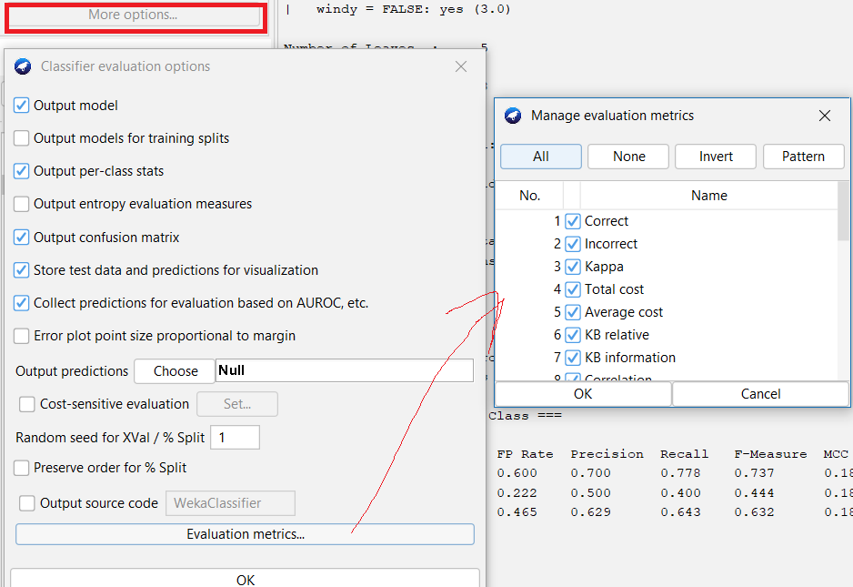


### Lucrul cu modele

După fiecare invocare a algoritmului, este generat un raport nou care este sălvat în listă.

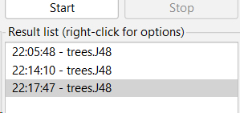

Făcând right click, putem accesa meniul de interacționare cu raportul.
De fapt, rularea unui algoritm produce și modelul care poate fi sălvat într-un fișier separat
în formatul unui obiect Java serializat.

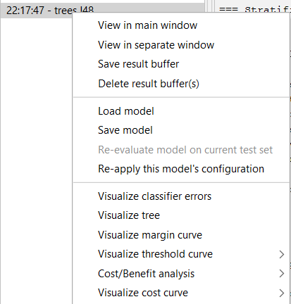

Apăsând butoanele "Visualize ..." putem accesa modalitățile diferite de vizualizare a modelului.
De exemplu, apăsând "Visualze tree" putem vedea arborele de decizie în forma grafică.

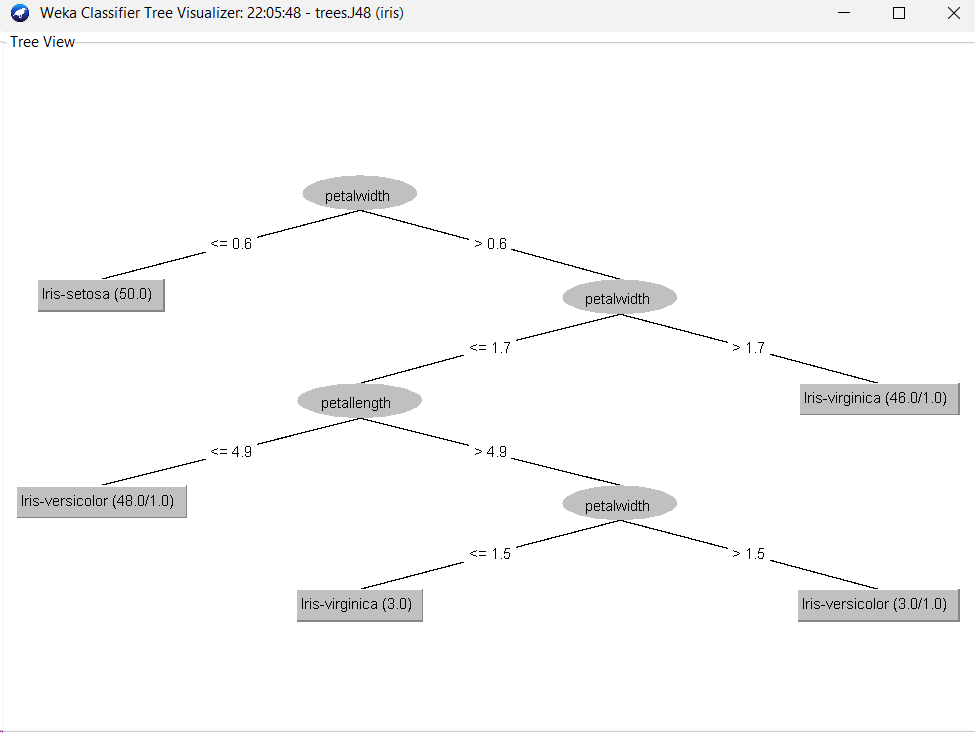

Sunt foarte multe alte opțiuni, care eu nu le cunosc,
dar care sunt cu siguranță utile în anumite situații.

## Clusterizare

Pentru acest exemplu, vom încărca setul de date care conține clasificările sticlei în funcție de compoziție chimică.
Ar dori să eliminăm coloana cu tipul. Pentru aceasta, dăm click pe coloana Type și apăsăm butonul "Remove".

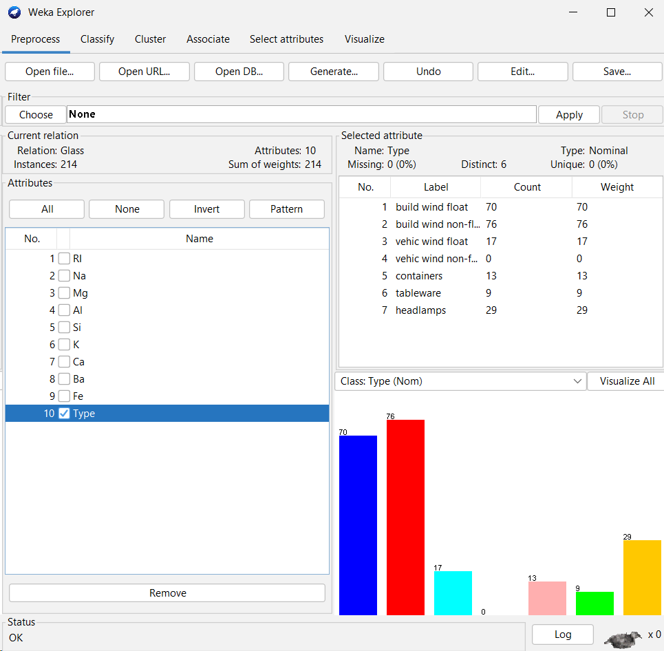

Procedăm la meniul "Cluster" și alegem algoritmul unul din algoritme.
Selectăm, de exemplu, algoritmul Cobweb, în același mod ca și la arbori de decizie.

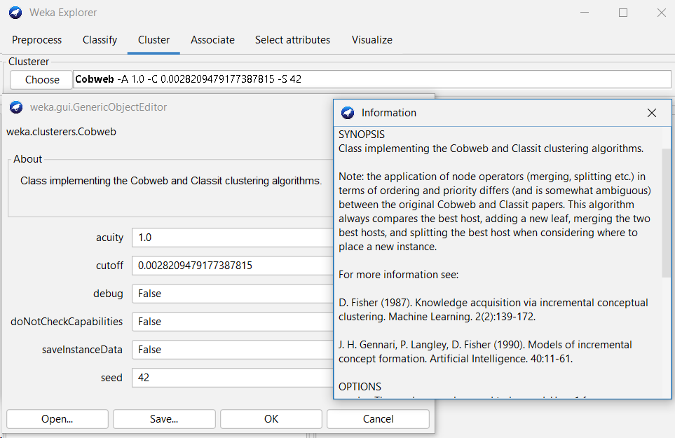

Dacă intrăm în mod de vizualizare, putem privi diferitele proiecții ale spațiului de date la spațiul 2D,
folosind diferitele perechi de atribute.
La imaginea ce urmează arătăm proiecția pe axele "RI" și "Na", iar culoarea indică la ce cluster aparține punctul.

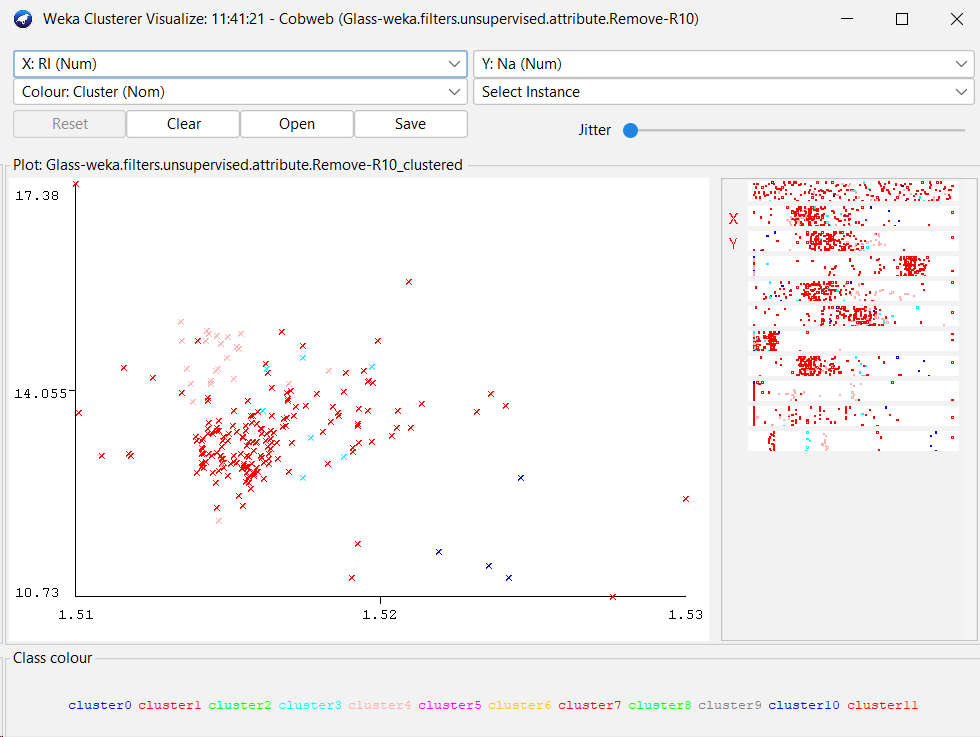

Am rulat și algoritmul K-Means, setând manual numărul de clusteri la 7 (ca în setul de date inițial):

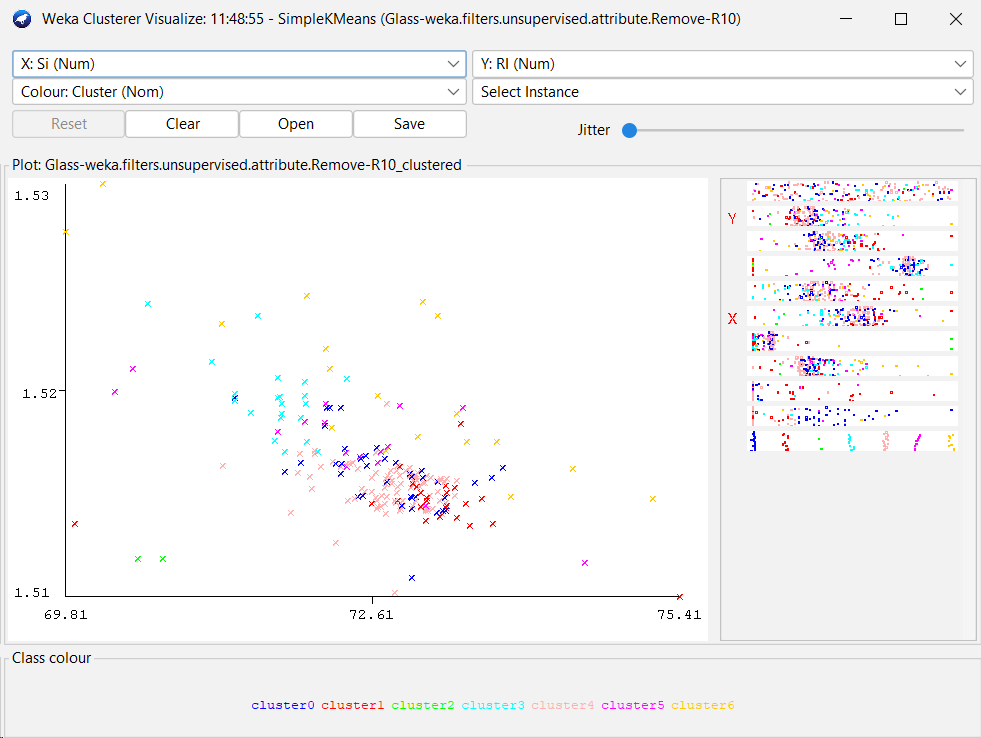


## Asociere

Pentru acest exemplu, vom încărca setul de date care conține informații despre cumpărături.
Algoritmul de asociere este Apriori.
Acesta indică care sunt combinațiile de produse care sunt cumpărate împreună
și ce seturi de produse sunt cumpărate cu o probabilitate mare după în coș deja este un alt set de produse.
Adică se derivă confidența că dacă un client a cumpărat un set de produse, atunci va cumpăra și alt set de produse.

Am rulat algoritmul în meniul Associate, primind următoarele rezultate:

```
=== Run information ===

Scheme:       weka.associations.Apriori -N 10 -T 0 -C 0.9 -D 0.05 -U 1.0 -M 0.1 -S -1.0 -c -1
Relation:     supermarket
Instances:    4627
Attributes:   217
              [list of attributes omitted]
=== Associator model (full training set) ===


Apriori
=======

Minimum support: 0.15 (694 instances)
Minimum metric <confidence>: 0.9
Number of cycles performed: 17

Generated sets of large itemsets:

Size of set of large itemsets L(1): 44

Size of set of large itemsets L(2): 380

Size of set of large itemsets L(3): 910

Size of set of large itemsets L(4): 633

Size of set of large itemsets L(5): 105

Size of set of large itemsets L(6): 1
```

Și s-au găsit următoarele reguli (arăt într-o tabelă).

| Antecedent (suport)                      | Consecvent  (suport) | Confidență | Lift | 
|------------------------------------------|----------------------|------------|------|
| biscuits, frozen foods, fruit (788)      | bread and cake (723) | 0.92       | 1.27 |
| baking needs, biscuits, fruit (760)      | bread and cake (696) | 0.92       | 1.27 |
| baking needs, frozen foods, fruit (770)  | bread and cake (705) | 0.92       | 1.27 |
| biscuits, fruit, vegetables (815)        | bread and cake (746) | 0.92       | 1.27 |
| party snack foods, fruit (854)           | bread and cake (779) | 0.91       | 1.27 |
| biscuits, frozen foods, vegetables (797) | bread and cake (725) | 0.91       | 1.26 |
| baking needs, biscuits, vegetables (772) | bread and cake (701) | 0.91       | 1.26 |
| biscuits, fruit (954)                    | bread and cake (866) | 0.91       | 1.26 |
| frozen foods, fruit, vegetables (834)    | bread and cake (757) | 0.91       | 1.26 |
| frozen foods, fruit (969)                | bread and cake (877) | 0.91       | 1.26 |


## Concluzii

Weka este un instrument foarte puternic pentru analiza datelor.
Este ușor de folosit și are o mulțime de algoritmi implementați.
Este un instrument util pentru a înțelege cum funcționează diferiți algoritmi de inteligență artificială.
Toate acestea având în vedere și faptul că în lucrare am folosit doar interfața principală a aplicației, 
anume Explorer-ul, iar Weka conține și celelalte interfețe mai specializate.
Nici nu se zice de faptul că sistemul Weka suportă programele în Java care pot accesa
toate funcționalitățile sistemului din cod.